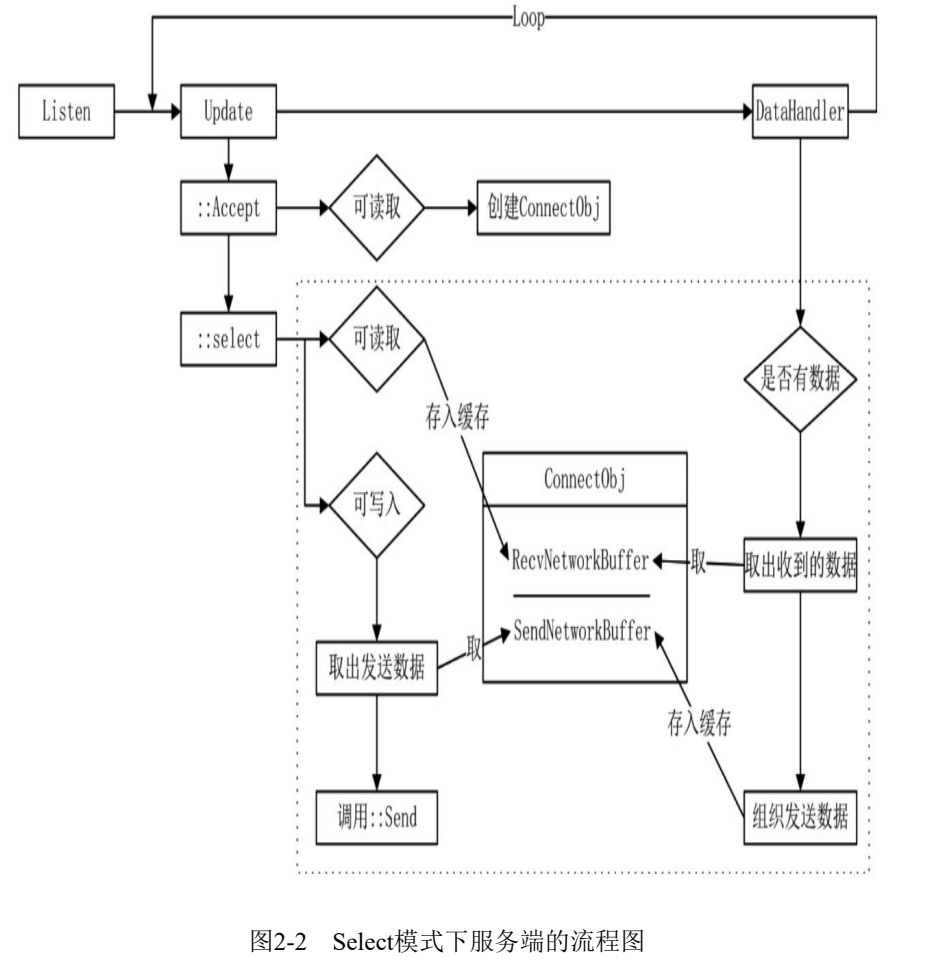
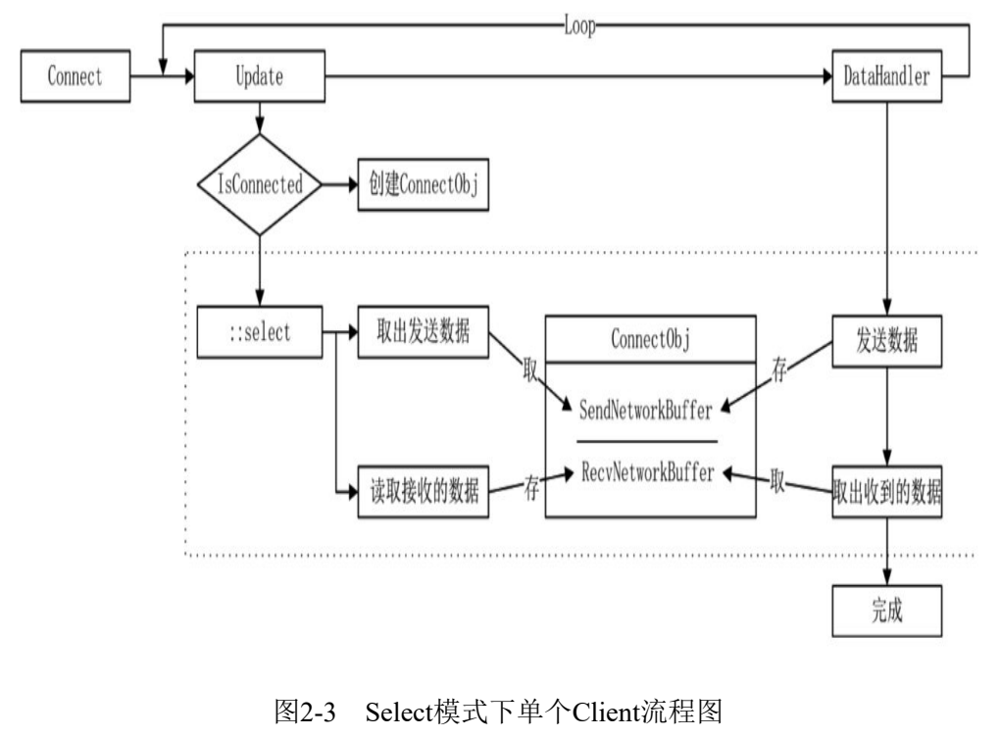

## 02_01_network_select

Select 网络模型

Select 是一个在 Windows 和 Linux 系统下通用的模型。该模型名为 Select 主要是因为它以名为 `::select` 的函数为驱动，该函数以不同的返回值来决定后续如何操作。简单来说，其主要的原理就是监视描述符（Socket）的变化来进行读写操作，且在必要时抛出异常。

在前面非阻塞的例子中，每一帧对每个 Socket 值进行了 `::recv` 函数调用，通过返回值来判断是否有数据到来，该方案的命中概率很低，而 Select 模型则提供了一种集合方式，让我们一次可以知道一个或者多个 Socket 是否有数据的变化。函数 `::select` 的主要功能是通过传入的参数告诉底层系统，我们关心的可读、可写、异常的 Socket。该函数被调用之后会反馈给我们传入的这些 Socket 是否处于可读、可写状态。

### Build all

```shell
xmake
```

### Run server

```shell
xmake r 02_01_network_select_app_server
```

### Run robot

```shell
# 开启 1 个线程，每个线程发送 2 条数据。
xmake r 02_01_network_select_app_robot 1 2
```

## Result

Server:

```shell
❯ xmake r 02_01_network_select_app_server
accept:0        recv count:0    send count:0
accept:1        recv count:0    send count:0
recv size:504 msg:xgmhetbuspxhmscmvzqmueuofaucuorxdwojfcrpficadukgcnzufvydovhlsbvkzeztfekzwhumckrqrvwrafbggytbybhlomxitwbneiqeixwmpkycfiltgqsvvvnvcgvbpsaspiklmjvexlhynwitejvdypnjpnmkbnvchkygffcbhotvbkkzasbmlhqzjxqeqveobkkqukvdhgkwvvmhgqgktyssgnghodqkmjtvdmjxgoflofokuoovffwbhzktshoswvhutkguuksikddvwykcpfdosilatpurqzfwkstorqpcqselzguxqzwfukbbzguzphjgvnfzzwewtccaskzfmanlmcxfmjnjfearnilmqiqidynzpiowxanvhvensmmahweuhewrwpgyaqrtktujvgtghyzqusihtgikajzrcaienphcswwmasbsifrounlargkwwxmqiiwiwkgkxsidfmurjgrsqrnwzqochjakkoxyopyd
accept:1        recv count:1    send count:1
recv size:153 msg:cutvdwxamdggqmdnikwyvglswlpnqdmdcvlhjxeejdbtptskdhacapncqrwhkgaydetupnmywvvuzgywocemdbnydyrakvzxyvzqijpddiuenxmkfocnzxobsfqvwtfrbtzlsucxuuntzfucjlmlfslmy
accept:1        recv count:2    send count:2
close socket:232
```

Robot:

```shell
❯ xmake r 02_01_network_select_app_robots 1 2
online socket num:1     completed:0%
send. size:504 msg:xgmhetbuspxhmscmvzqmueuofaucuorxdwojfcrpficadukgcnzufvydovhlsbvkzeztfekzwhumckrqrvwrafbggytbybhlomxitwbneiqeixwmpkycfiltgqsvvvnvcgvbpsaspiklmjvexlhynwitejvdypnjpnmkbnvchkygffcbhotvbkkzasbmlhqzjxqeqveobkkqukvdhgkwvvmhgqgktyssgnghodqkmjtvdmjxgoflofokuoovffwbhzktshoswvhutkguuksikddvwykcpfdosilatpurqzfwkstorqpcqselzguxqzwfukbbzguzphjgvnfzzwewtccaskzfmanlmcxfmjnjfearnilmqiqidynzpiowxanvhvensmmahweuhewrwpgyaqrtktujvgtghyzqusihtgikajzrcaienphcswwmasbsifrounlargkwwxmqiiwiwkgkxsidfmurjgrsqrnwzqochjakkoxyopyd
recv. size:504
send. size:153 msg:cutvdwxamdggqmdnikwyvglswlpnqdmdcvlhjxeejdbtptskdhacapncqrwhkgaydetupnmywvvuzgywocemdbnydyrakvzxyvzqijpddiuenxmkfocnzxobsfqvwtfrbtzlsucxuuntzfucjlmlfslmy
recv. size:153
close socket:232
online socket num:0     completed:100%
```

## Diagrams





## References

- [你管这破玩意叫 IO 多路复用？](https://mp.weixin.qq.com/s/YdIdoZ_yusVWza1PU7lWaw)
